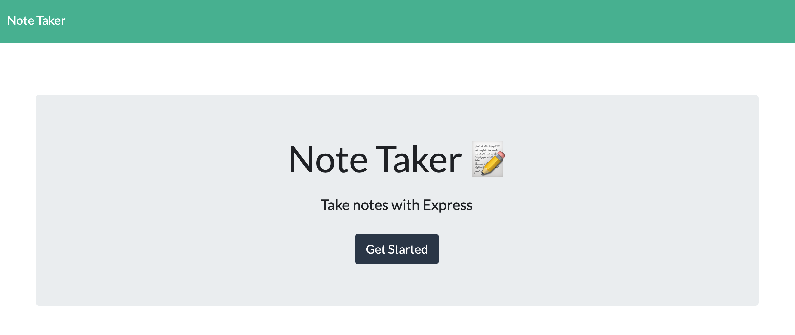
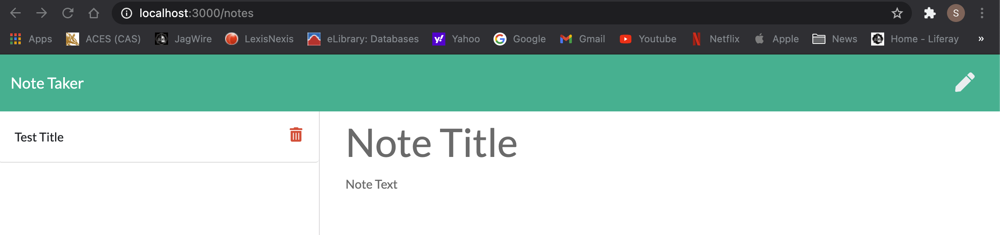
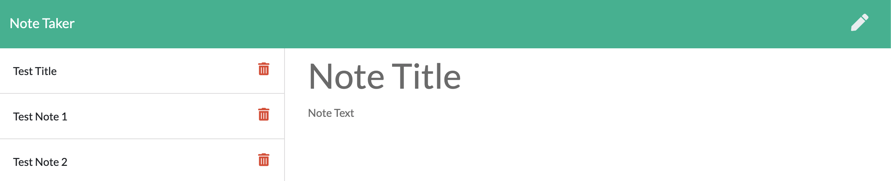

# Note-Taker App

## Description

[Note Taker App](https://github.com/ssolis86/Note-Taker) allows the user to manage daily task notes.

## Installation
- npm install "dotenv"
- npm install "express"
- npm install
- run node server.js (to start application)
- go to "localhost:3000/notes" in your browswer to access application

## Screenshots of Application

### Landing Page

### Notes Page

### Added Notes Page

